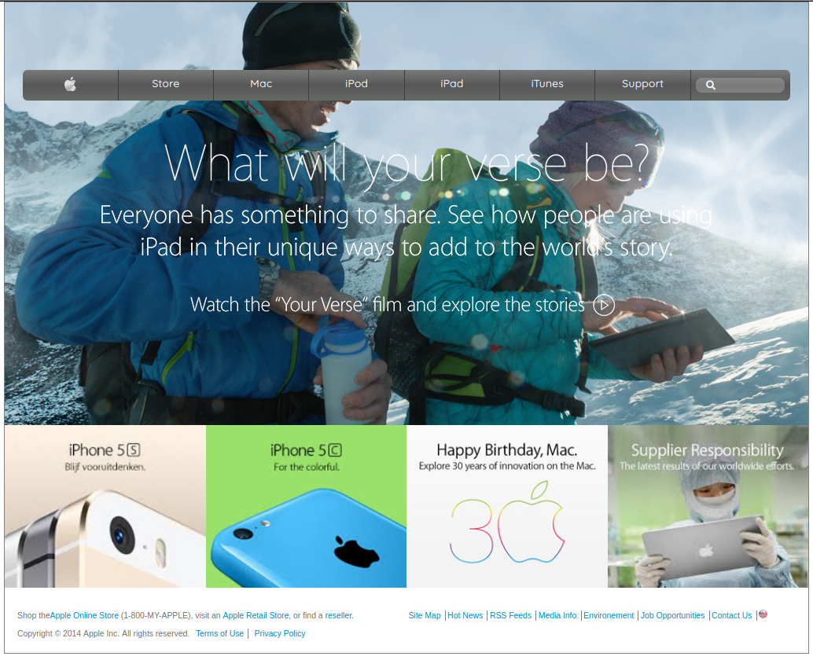

# Apple-clone
## Description
In this project, I tried to create a clone of the former Apple web page (http://archive.fo/UW4oR). The purpose of this exercise is to apply background styling lessons in CSS and to master the Grid, flex and positioning concept too.




## Built With
- HTML & CSS
- CSS grid
- CSS flex box
- CSS background gradient

## Usage
```Git
git clone https://github.com/CalyCherkaoui/Apple-clone
cd Apple-clone
git checkout development
firefox index.html
```
## Demo
https://rawcdn.githack.com/CalyCherkaoui/Apple-clone/f17c64103862b6caa2988e5a4861ae0d4743ba17/index.html

## Authors
👩 **Houda Cherkaoui**
- Twitter: https://twitter.com/Houda59579688
- Github:https://github.com/CalyCherkaoui/

## Contributing
Pull requests are welcome. For major changes, please open an issue first to discuss what you would like to change.

Support this project with a ⭐️ and let us now if you would like to become a contributor!